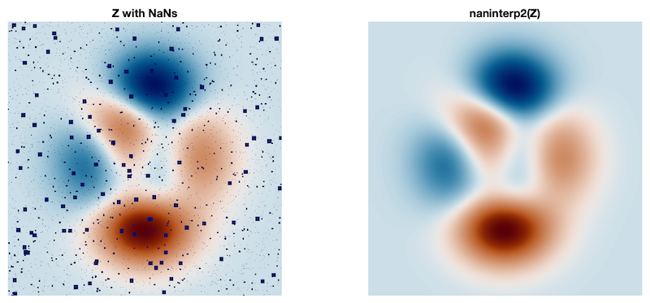

# 2-D optimized linear interpolation

## naninterp2.m

The `griddata` Matlab's core function may fail with memory issue on huge grids, depending on your computer capabilities, even for simple linear interpolation to fill gaps. `naninterp2` is a simple function that optimizes the linear interpolation by reducing the amount of relevant data (only gap neighbours) before calling `griddata`. This results in a very fast computing, as the speed mainly depends on the amount of gaps and less on the amount of valid data (i.e., size of the grid). See benchmarks below.

### Example
```matlab
z = peaks(1000);
% simulates random gaps of different sizes
for n = [10,5,2]
  z(ceil(rand(1e4/n^2,1)*numel(z))) = NaN;
  z = conv2(z,ones(n)/n,'same');
end

subplot(121)
imagesc(z); % with gaps
subplot(122)
imagesc(naninterp2(z)) % gaps filled
```



### Benchmarks

This a comparison of computation times of interpolation for a 1000x1000 grid with about 5% of NaN contain (upper example) when using `griddata` and `naninterp2` functions.

|code| Matlab 2020a| GNU Octave 5.1|
|----:|--------:|-------:|
|griddata.m | 4.2 s|  3 mn |
|naninterp2.m | **0.16 s**| 12 s|

## Author
**François Beauducel**, [IPGP](www.ipgp.fr), [beaudu](https://github.com/beaudu), beauducel@ipgp.fr

## Documentation
Type `doc naninterp2` for help and syntax.
